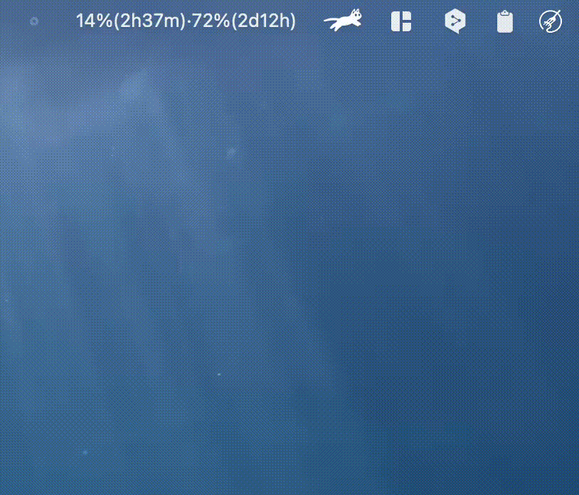

# Claude Usage Widget for SwiftBar

A lightweight macOS menu bar plugin that shows your **Claude Code usage** at a glance — session limit, weekly limit, reset countdown, and token counts.

Claude Code 사용량을 macOS 메뉴바에서 바로 확인할 수 있는 SwiftBar 플러그인입니다.

---

## Preview



메뉴바에 세션 한도와 주간 한도가 실시간으로 표시됩니다.

Displays session and weekly usage limits in real time directly in your menu bar.

클릭하면 상세 정보를 확인할 수 있습니다 / Click to see details:

```
12%(2h59m)·71%(2d12h)
─────────────────────────
⏱ 세션 (5h)  12%   리셋 2h59m
📅 주간 (7d)  71%   리셋 2d12h
─────────────────────────
오늘 토큰   278K
이번 주 토큰  3.7M
─────────────────────────
새로고침
```

| Menu bar | Detail |
|----------|--------|
| `12%(2h59m)` | 5-hour session usage · reset in 2h 59m |
| `71%(2d12h)` | 7-day weekly usage · reset in 2d 12h |

---

## How it works / 동작 원리

- **Session & weekly limits**: Reads `anthropic-ratelimit-*` headers from a minimal 1-token API ping (costs ~$0.000001 per refresh). No dedicated usage endpoint needed.
- **Token counts**: Parses `~/.claude/projects/**/*.jsonl` session files directly — no external calls.
- **Auth**: Reads your existing Claude Code access token from macOS Keychain. No additional setup needed.

---

## Requirements / 필요 사항

| | |
|---|---|
| macOS | 12 Monterey 이상 |
| [Claude Code](https://claude.ai/code) | 설치 및 로그인 완료 상태 |
| [SwiftBar](https://github.com/swiftbar/SwiftBar) | 메뉴바 플러그인 실행기 |
| Python 3 | macOS 기본 내장 |
| curl | macOS 기본 내장 |

---

## Installation / 설치 방법

### 1. Install SwiftBar / SwiftBar 설치

```bash
brew install --cask swiftbar
```

> Homebrew가 없다면 먼저 설치하세요: https://brew.sh

### 2. Create plugin folder / 플러그인 폴더 생성

```bash
mkdir -p ~/.swiftbar
```

### 3. Install the plugin / 플러그인 설치

두 가지 방법 중 선택하세요. / Choose one of two methods:

#### Option A: Download (단순 설치)

```bash
curl -o ~/.swiftbar/claude_usage.5m.sh \
  https://raw.githubusercontent.com/jisub-kim/claude-usage-widget/main/claude_usage.5m.sh

chmod +x ~/.swiftbar/claude_usage.5m.sh
```

#### Option B: Clone + Symlink (자동 업데이트)

repo를 클론한 뒤 심링크를 걸면, `git pull`만으로 스크립트가 자동 업데이트됩니다.

Clone the repo and create a symlink — updates are applied automatically with `git pull`.

```bash
git clone https://github.com/jisub-kim/claude-usage-widget.git ~/Developer/claude-usage-widget

ln -s ~/Developer/claude-usage-widget/claude_usage.5m.sh ~/.swiftbar/claude_usage.5m.sh
```

> 클론 경로는 원하는 곳으로 변경 가능합니다.
> You can clone to any directory you prefer.

### 4. Launch SwiftBar / SwiftBar 실행

```bash
open -a SwiftBar
```

SwiftBar가 처음 실행되면 플러그인 폴더를 지정하는 창이 뜹니다.
`~/.swiftbar` 폴더를 선택하세요.

> When SwiftBar launches for the first time, it will ask for a plugin folder. Select `~/.swiftbar`.

---

## Refresh interval / 갱신 주기

파일명의 숫자가 갱신 주기를 결정합니다. 파일명을 바꾸면 주기가 바뀝니다.

The number in the filename controls the refresh interval.

| Filename | Interval |
|----------|----------|
| `claude_usage.1m.sh` | 1분마다 / Every 1 min (비추천 / not recommended) |
| `claude_usage.5m.sh` | 5분마다 / Every 5 min |
| `claude_usage.10m.sh` | 10분마다 / Every 10 min |

```bash
# 예시: 10분으로 변경 / Change to 10 min

# Option A (다운로드 방식)
mv ~/.swiftbar/claude_usage.5m.sh ~/.swiftbar/claude_usage.10m.sh

# Option B (심링크 방식) — 기존 심링크를 새 이름으로 재생성
rm ~/.swiftbar/claude_usage.5m.sh
ln -s /path/to/claude-usage-widget/claude_usage.5m.sh ~/.swiftbar/claude_usage.10m.sh
```

---

## Manual refresh / 수동 갱신

메뉴바 아이콘 클릭 → **새로고침**

Click the menu bar icon → **새로고침**

---

## Troubleshooting / 문제 해결

### 메뉴바에 아무것도 안 보여요 / Nothing shows in menu bar

1. SwiftBar가 실행 중인지 확인하세요.
2. SwiftBar의 플러그인 폴더가 `~/.swiftbar`로 설정되어 있는지 확인하세요.
   - 메뉴바 SwiftBar 아이콘 → Preferences → Plugin Folder
3. SwiftBar를 재시작해보세요.
   ```bash
   killall SwiftBar; open -a SwiftBar
   ```

### `?`만 표시돼요 / Shows only `?`

Claude Code에 로그인이 되어 있지 않거나 토큰이 만료된 상태입니다.
Claude Code를 실행해서 다시 로그인하면 자동으로 토큰이 갱신됩니다.

```bash
claude
```

### 토큰 수가 0이에요 / Token count shows 0

오늘 Claude Code 세션이 없는 경우 0으로 표시됩니다.
`~/.claude/projects/` 폴더에 오늘 날짜의 `.jsonl` 파일이 있는지 확인하세요.

---

## Security / 보안

- 스크립트에 API 키나 토큰이 **하드코딩되어 있지 않습니다**.
- macOS Keychain에서 Claude Code가 저장한 토큰을 런타임에 읽습니다.
- 외부로 전송되는 정보: Anthropic API에 1토큰짜리 더미 요청 (한도/리셋 헤더 확인용)

No credentials are hardcoded. The script reads your existing Claude Code token from macOS Keychain at runtime. The only external call is a 1-token ping to `api.anthropic.com` to retrieve rate-limit headers.

---

## Credits

Inspired by [claude-monitor](https://github.com/rjwalters/claude-monitor) — the rate-limit header technique is based on that project's approach.
